# Mini Issue Tracker (Laravel)

A lightweight Issue Tracking app where a small team can manage **Projects, Issues, Tags, Members, and Comments**.  
Built with **Laravel**, **Blade**, **Tailwind**, and a sprinkle of **AJAX**.

---

## ✨ Features

### Projects
- CRUD (list, create, edit, delete).
- Show page with project meta (start date, deadline, issue count).
- **Ownership**: each project has an `owner_id`. Only the owner can edit/delete.
- Extra columns: `start_date`, `deadline` (added via migration).

### Issues
- Belongs to a Project.
- Fields: `title`, `description`, `status (open|in_progress|closed)`, `priority (low|medium|high)`, `due_date`.
- **Filters** (server-side): by status, priority, and tag.
- **Search** (bonus): text search on title/description with **debounce + AJAX**.
- **Auth rules**:
  - Create new issue: only the **project owner**.
  - Edit/Delete: issue **creator** OR **project owner**.

### Tags
- Create & list tags (unique `name`, optional `color`).
- Many-to-many with issues via `issue_tag`.
- **AJAX attach/detach** tags on the issue page (no full reload).

### Comments
- Load comments on the issue page via **AJAX** (paginated).
- Add a comment via **AJAX** (validates `author_name` & `body`), prepends to the list, updates count inline.

### Members (Bonus)
- Many-to-many `issue_user`: assign multiple **users** to an issue.
- **AJAX attach/detach** members from an issue.
- Only logged-in **issue creator** or **project owner** can manage members/tags.

### UI/UX
- Blade layouts & partials, Tailwind styling.
- Clean nav: Projects, Issues, Tags.
- Buttons/links respect **auth** and **policies** (only show actions you’re allowed to do).
- Modals to manage Tags & Members (AJAX).

---

## 🧱 Data Model

#### Project
- `id`, `owner_id (FK users.id)`, `name`, `description`, `start_date`, `deadline`, timestamps  
- **Relationships**: `hasMany(Issue)`, `belongsTo(User owner)`

#### Issue
- `id`, `project_id (FK)`, `title`, `description`, `status`, `priority`, `due_date (nullable)`, `created_by (FK users.id)`, timestamps  
- **Relationships**: `belongsTo(Project)`, `hasMany(Comment)`, `belongsToMany(Tag)`, `belongsToMany(User as members)`

#### Tag
- `id`, `name (unique)`, `color (nullable)`, timestamps  
- **Relationships**: `belongsToMany(Issue)`

#### Comment
- `id`, `issue_id (FK)`, `author_name`, `body`, timestamps  
- **Relationships**: `belongsTo(Issue)`

#### Pivots
- `issue_tag (issue_id, tag_id)`  
- `issue_user (issue_id, user_id)` (bonus members)

> Enums used for `Issue.status` and `Issue.priority` (PHP Enums cast in the model).

---

## 🔐 Authentication & Authorization

- **Auth**: Laravel Breeze.
- **Policies**:
  - **ProjectPolicy**: `update/delete` → only `owner_id`.
  - **IssuePolicy**:
    - `create` → only **project owner**.
    - `update/delete` → **issue creator** or **project owner**.
  - **Tag/Member attach/detach** → only when **logged in** AND authorized as above.

UI hides Edit/Delete/New buttons unless `@auth` + `@can(...)` pass.

---

## 🚦 Routes (highlights)

Resource routes:
```
projects.*               // index, create, store, show, edit, update, destroy
projects.issues.*        // nested resource (shallow)
issues.index             // list all issues
tags.index, tags.store   // list/create tags
```

AJAX endpoints:
```
GET    /issues/search                     -> IssueController@search          (name: issues.search)
GET    /issues/{issue}/comments           -> CommentController@index         (JSON: html + next)
POST   /issues/{issue}/comments           -> CommentController@store         (JSON: html + count)

POST   /issues/{issue}/tags               -> IssueTagController@attach       (JSON: html)
DELETE /issues/{issue}/tags/{tag}         -> IssueTagController@detach       (JSON: html)

POST   /issues/{issue}/members            -> IssueMemberController@attach    (JSON: html)
DELETE /issues/{issue}/members/{user}     -> IssueMemberController@detach    (JSON: html)
```

Auth routes from Breeze are included via `require __DIR__.'/auth.php';`.

---

## 🔍 AJAX Search (debounce)

- On **Issues Index**, a search field fires an AJAX request after 300ms of inactivity.
- Controller returns a rendered partial `issues/_items.blade.php` as HTML inside JSON.
- Works together with the select filters (status/priority/tag) and optional `project_id`.

Example front-end hook:
```html
<input id="search-input" data-url="{{ route('issues.search') }}" />
<script>
let t;const i=document.getElementById('search-input');i.addEventListener('input',()=>{clearTimeout(t);t=setTimeout(async()=>{
  const r = await fetch(i.dataset.url+'?q='+encodeURIComponent(i.value),{headers:{Accept:'application/json'}});
  const d = await r.json(); document.getElementById('issue-list').innerHTML=d.html;
},300)});
</script>
```

---

## 🏎️ Performance

- Eager loading used across lists: `with(['project','tags'])`, `withCount('comments')`.
- Shallow nesting for `projects.issues` to keep URLs clean.

---

## 🛠️ Tech Stack

- **Laravel** 10+/11
- **Blade**, **TailwindCSS**
- **MySQL**
- **Laravel Breeze** (Auth)
- Vanilla JS + **fetch** for AJAX

---

## 🧪 Setup & Run

```bash
# 1) Install deps
composer install
npm install

# 2) Env
cp .env.example .env
# set DB_* variables
php artisan key:generate

# 3) Migrate & seed
php artisan migrate --seed

# 4) Run
php artisan serve
npm run dev    # or: npm run build
```

> **Login:** check `database/seeders/DatabaseSeeder.php` for seeded user credentials (owner & regular user).

---

## 🧰 Notes & Troubleshooting

- **Post-login redirect** → configured to `route('projects.index')` (Breeze `AuthenticatedSessionController@store`).
- **419 Page Expired** locally: use one host (`http://localhost:8000` **or** `http://127.0.0.1:8000`), set `APP_URL` accordingly, and run:
  ```bash
  php artisan optimize:clear
  ```
- If you added `owner_id` to existing `projects`, ensure the migration backfills owners (nullable → fill → not null) before adding the FK.

---

## ✅ What’s Implemented vs. Task

- **Functional**
  - Projects: ✅ CRUD + show with issues
  - Issues: ✅ list + filters; ✅ create/edit/delete; ✅ detail page
  - Tags: ✅ create/list; ✅ attach/detach via AJAX
  - Comments: ✅ AJAX load (paginated) & create (validates, prepends)
- **UI/UX**
  - Blade + AJAX ✅
  - Modal for Tag/Member attach/detach ✅
  - Inline validation messages ✅
- **Technical**
  - Resource Controllers ✅
  - Form Requests ✅
  - Migrations/Factories/Seeders ✅
  - Eager Loading ✅
- **Bonus**
  - Members (issue_user) ✅ (attach/detach via AJAX)
  - Policies (owner/creator rules) ✅
  - Search with debounce (AJAX) ✅

---

## 📦 Project Structure (relevant bits)

```
app/
  Http/Controllers/
    ProjectController.php
    IssueController.php
    CommentController.php
    TagController.php
    IssueTagController.php
    IssueMemberController.php
  Http/Requests/
    ProjectRequest.php
    IssueRequest.php
    TagRequest.php
  Policies/
    ProjectPolicy.php
    IssuePolicy.php
Models/
  Project.php
  Issue.php
  Tag.php
  Comment.php
resources/views/
  layouts/
    app.blade.php
    nav.blade.php
  projects/
    index.blade.php
    show.blade.php
    create.blade.php
    edit.blade.php
  issues/
    index.blade.php
    show.blade.php
    _items.blade.php
    _tag_pills.blade.php
    _member_pills.blade.php
    create.blade.php
    edit.blade.php
  tags/
    index.blade.php
database/
  migrations/
  seeders/
routes/
  web.php
  auth.php
```

## 🖼️ Screenshots

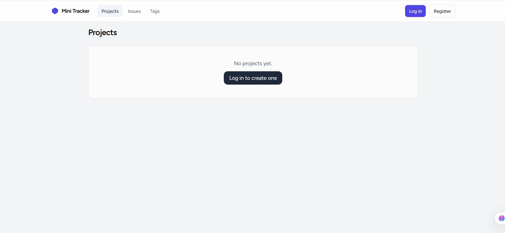
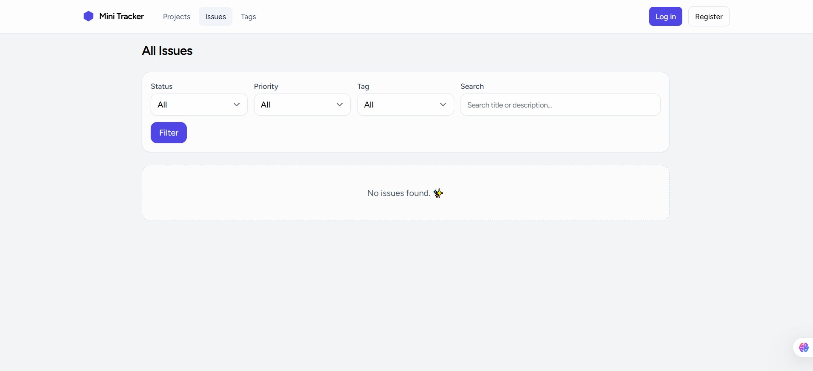
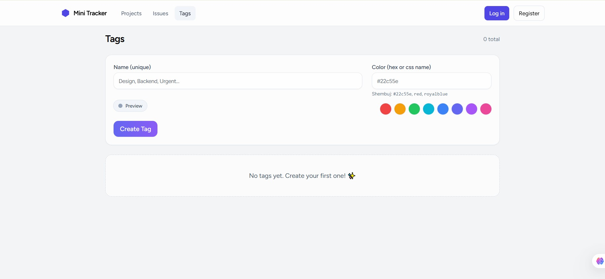
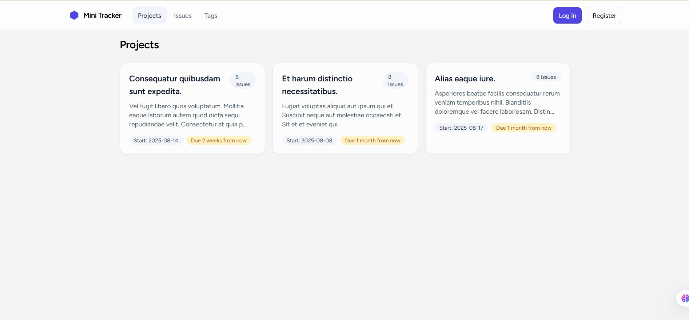
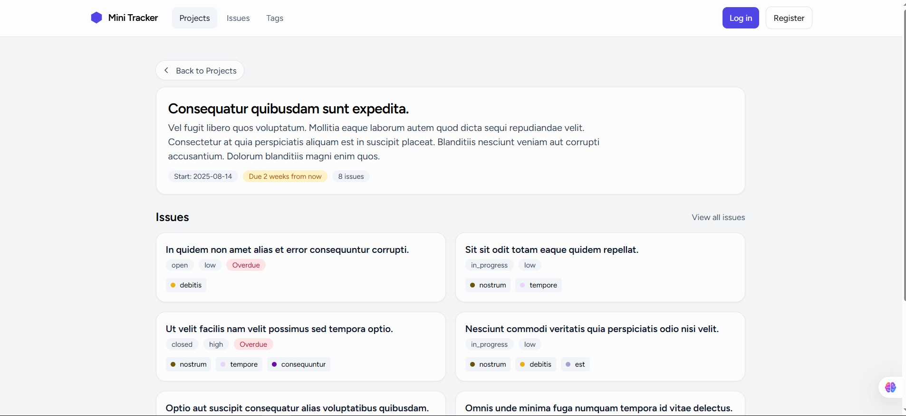
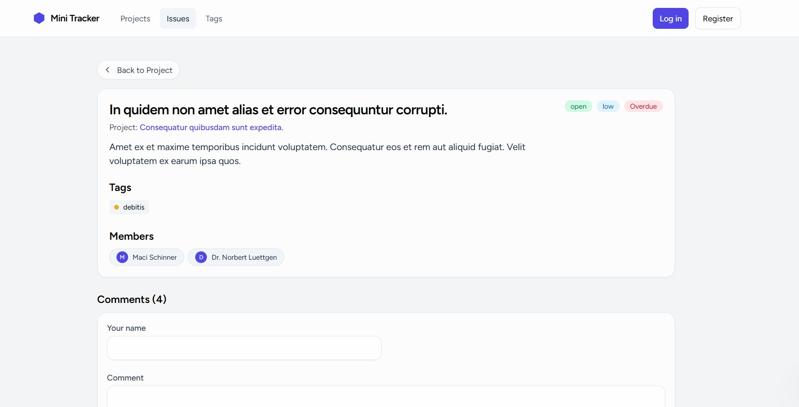
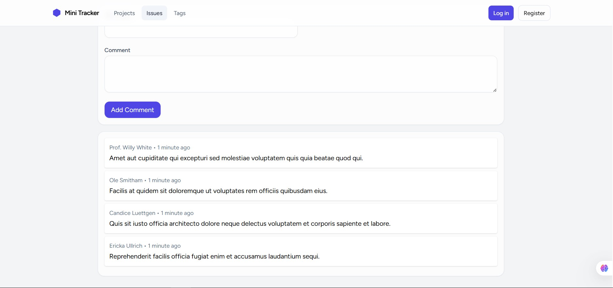
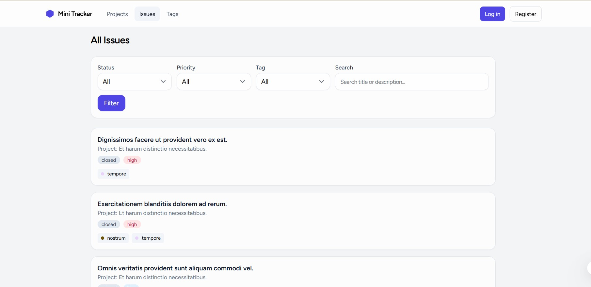
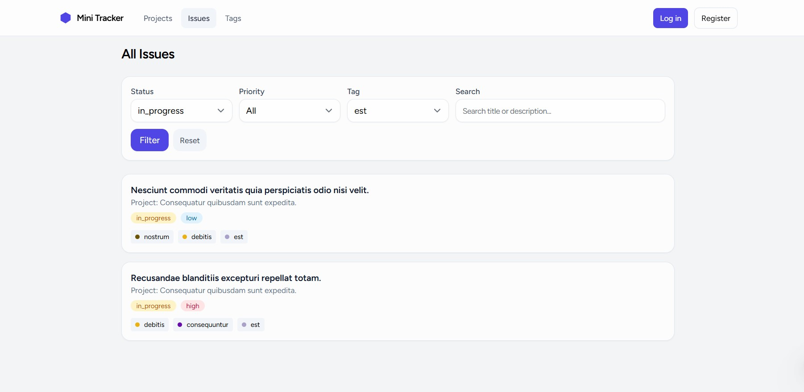
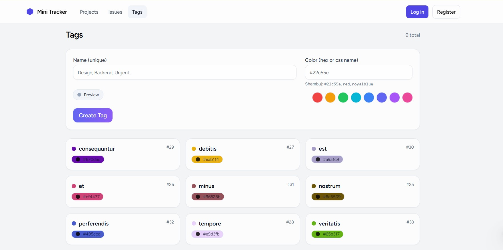
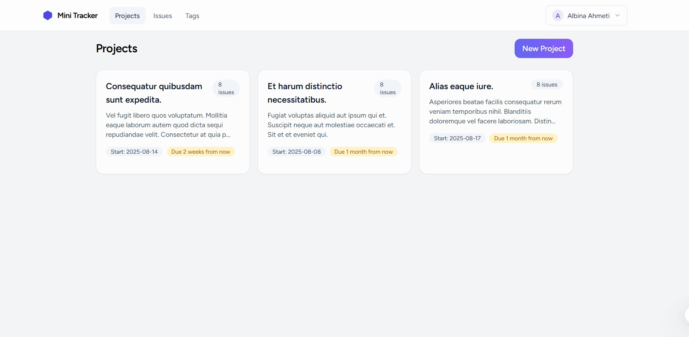
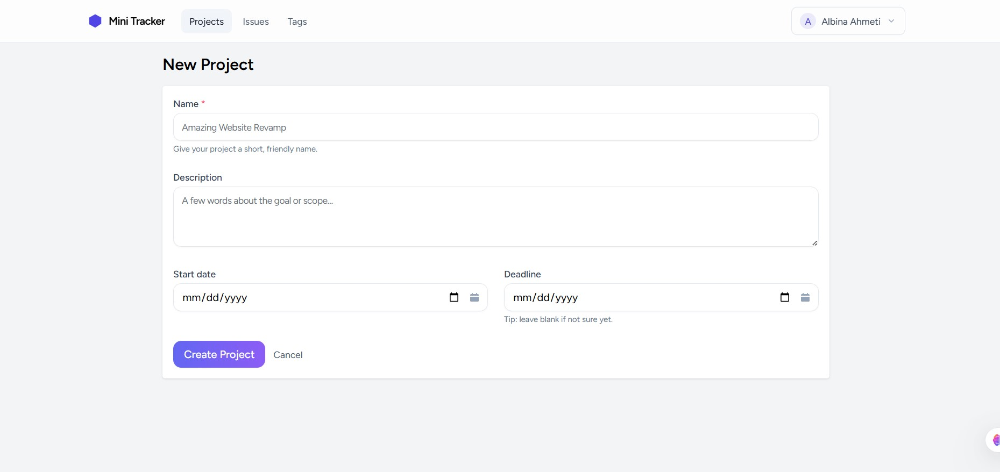
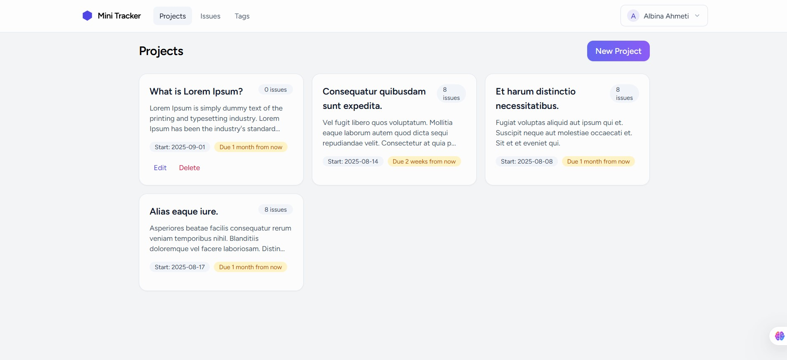
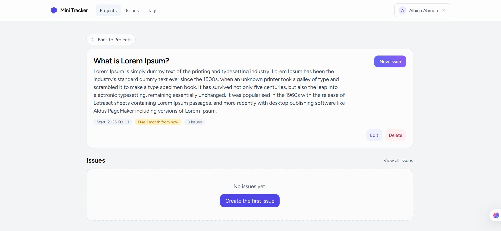
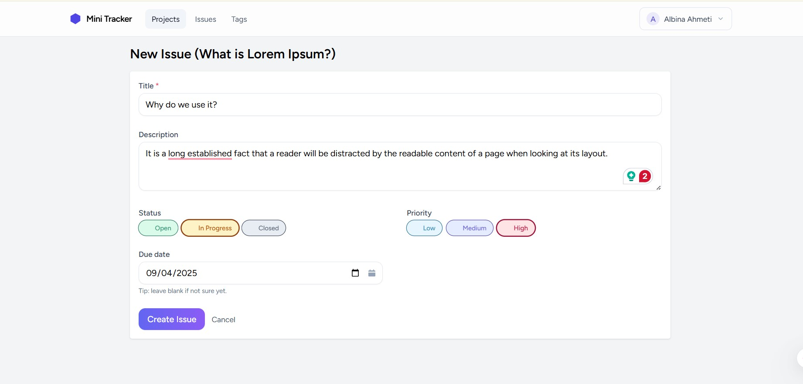
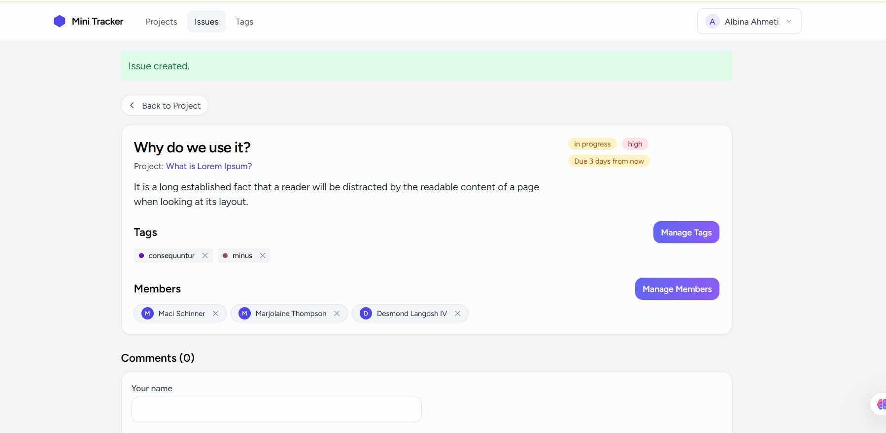
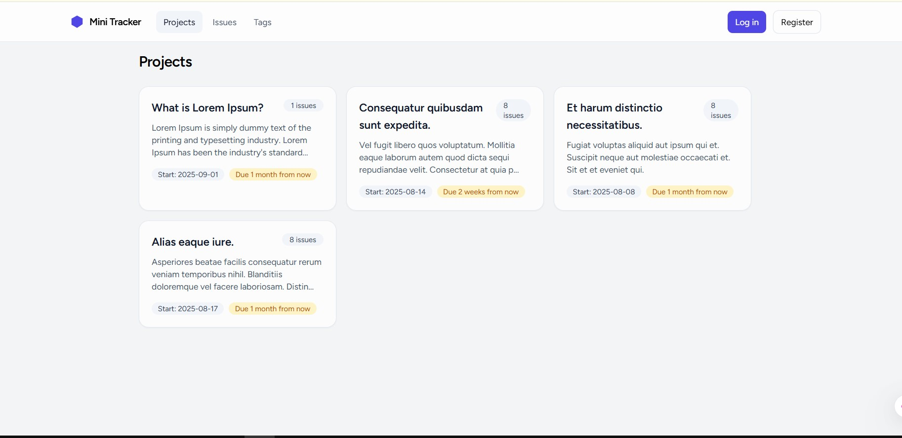